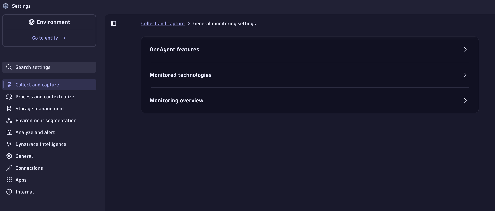

--8<-- "snippets/requirements.md"

## Prerequisites

You will need full administrator access to a Dynatrace SaaS tenant with a DPS license.

* Enable OpenTelemetry OneAgent Features
* Enable Log Enrichment OneAgent Features

### Enable OpenTelemetry OneAgent Features

The demo application in this lab, AstroShop, contains OpenTelemetry instrumentation that can be picked up by OneAgent.

Navigate to the `Settings` app in the Dynatrace tenant.  Click on `Collect and Capture`and then `OneAgent Features` from the Menu on the left bar.  Search for features that contain the word `OpenTelemetry`.  Enable all OneAgent features for OpenTelemetry.

### Enable Log Enrichment OneAgent Features

Dynatrace can enrich your ingested log data with additional information that helps Dynatrace to recognize, correlate, and evaluate the data. Log enrichment results in a more refined analysis of your logs.  Log enrichment enables you to seamlessly switch context and analyze individual spans, transactions, or entire workloads.

Navigate to the `Settings` app in the Dynatrace tenant.   Click on `Collect and Capture` and then  `OneAgent Features` from the Menu on the left bar.  Search for features that contain the words `enrichment for`.  Enable all OneAgent features for Log Enrichment.

!!! tip "Node.js Log Enrichment"
    Technically you only need to enable Log Enrichment for **Node.js** for this lab.  However, we recommend enabling this capability for all technologies to get the most value out of your log data.

## Knowledge check

<!-- LAB_QUESTION
type: multiple-choice
question: "Why do we enable the Log Enrichment OneAgent features in this lab?"
options:
  - "So Dynatrace can correlate log records with the traces, spans, and Kubernetes entities that produced them"
  - "So OneAgent compresses logs before sending them, reducing ingest cost"
  - "So logs are encrypted at rest in Grail"
  - "So the Log Module can run without the Dynatrace Operator"
correct: 0
explanation: "Log enrichment adds metadata that lets Dynatrace recognize, correlate, and evaluate logs — enabling you to switch context between a log record and the span, transaction, or workload that produced it."
-->

!!! info "These settings are prerequisites"
    Both OneAgent feature groups (OpenTelemetry and Log Enrichment) must be enabled **before** you deploy Dynatrace in the next sections, otherwise the enrichment context will be missing from the logs you ingest.

## Continue

In the next section, we'll launch our Codespaces instance.

- [Continue to Codespaces:octicons-arrow-right-24:](3-codespaces.md)

